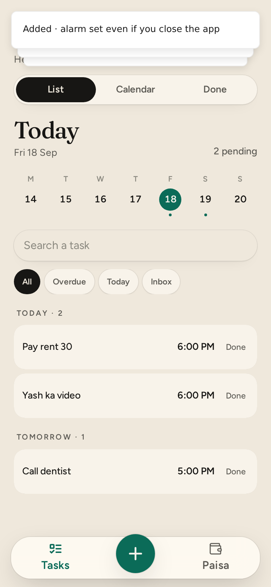
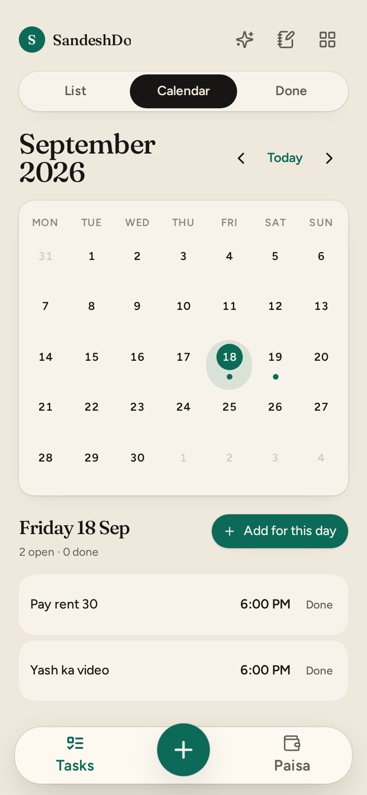
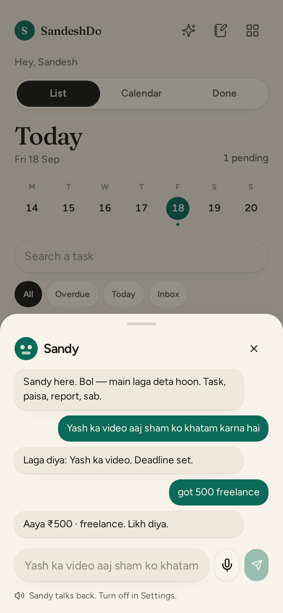

<p align="center">
  <a href="https://github.com/SandeshL702/sandeshdo/releases/latest/download/SandeshDo.apk"><strong>Download SandeshDo.apk</strong></a>
  · direct install, not a zip
</p>

<p align="center">
  
</p>

# SandeshDo — Hinglish Todo & Android Reminder App

**Remember it. Do it. Finish it.**

Private offline task manager for India — people who think in Hinglish. Say the work once. It becomes a task with a real reminder, even if the app is closed. No account. No cloud required.

<p align="center">
  <a href="https://github.com/SandeshL702/sandeshdo/releases"></a>
  <a href="LICENSE"></a>
  
  
</p>

<p align="center">
  
  
  
</p>

## Say this. It happens.

| You say | SandeshDo does |
|---|---|
| `Yash ka video aaj sham ko khatam karna hai` | Task **Yash ka video** · today 6pm · reminder on |
| `kal 5 baje dentist` | Tomorrow 5pm. Heads-up banner when due |
| `got 500 freelance` | Paisa in |
| `gaya 80 chai` | Paisa out |
| `kya pehle karna chahiye` | Sandy reads your list and picks |

No feed. No streak theater. No “sign in to continue”.

## What’s inside

- **Today** — overdue, aaj, kal, inbox. Tick it. It’s done.
- **Calendar** — month view with dots. Tap a day, see the work.
- **Paisa** — Got / Spent cashbook. Budgets. Day graph. Freelance + client.
- **Notes · Plans · Vault** — Keep-style notes, long-term plans, AES-locked passwords.
- **Sandy** — talks Hinglish, adds deadlines, logs money, writes a report. Works without a key.
- **Alerts** — Android alarm + small heads-up banner. App can be closed.
- **Backup** — JSON on the phone. Share to Drive. Uninstall, restore.

English or Hinglish. Default English.

## Install (Android)

**[Download SandeshDo.apk](https://github.com/SandeshL702/sandeshdo/releases/latest/download/SandeshDo.apk)** — the file on Releases. Not the green “Code → Download ZIP”.

Package `com.sandesh.sandeshdo` · **2.1.5**

1. Open the `.apk` (if the phone says zip, rename to `.apk` — Android packages are zip under the hood)
2. Allow **notifications** and **exact alarms**
3. Xiaomi / Vivo / Oppo — turn **Autostart** on

Install over the old SandeshDo. Your data stays.

## Run from source

```bash
npm i
npm run dev
```

Android APK:

```bash
./android/build-apk.sh
```

## Privacy, on purpose

- Data lives on the phone
- Vault is AES-GCM
- Optional AI key never goes into a shared backup
- No tracker, no ads, no account

## Stack

React · TanStack Start · Zustand · Android WebView + `AlarmManager`

## License

MIT. Made by [Sandesh](https://github.com/SandeshL702).

If this saves you one missed call, star it so the next person finds it.
